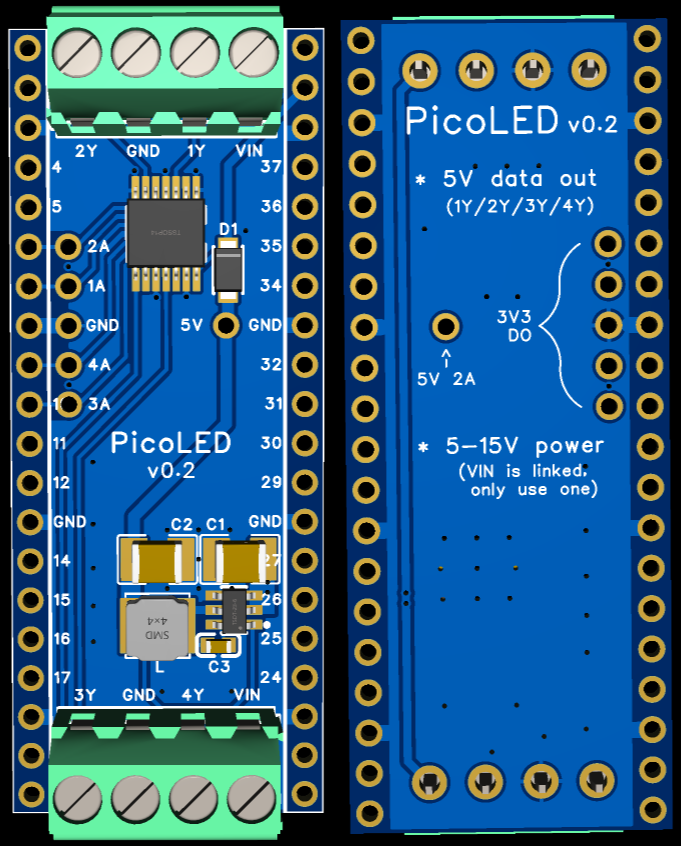

  
   

# PicoLED

Raspberry Pi Pico HAT with:

- 5-32V power input (using AP63205)
- 4x 5V outputs (using 74HCT125)

Designed for controlling WS28xx LED strips and powering the Pico from the LED strip.

## PCB Design

Note: I'm not an expert so any advice is appreciated.

Done in EasyEDA, then exported to here so we can version control it.

### Pico GPIO

Using GP8-11 (pins 11-15) because they're a convenient position. The traces have a space where they can be cut if you don't want these. The 3v3 inputs to the level shifter are sized like and aligned with header through-holes, so they can be remapped.

### Screw terminals

The biggest one that can fit 4 terminals at each end of a Pico footprint.
Turned out to be 3.5mm, though we'll see when it's made whether I can still fit headers on either side.
The alignment is so that they stick out just a bit, to make fitting a case easier.

You may want smaller terminals if you want to mount the HAT under a Pico. I plan to put it on top of a W5500-EVB-Pico.

### Inductor

- Rated at 2A, with at least 2.7A I_sat.
- <100mR ESR.
- 4x4mm.

FB pin of AP63205 (reads 5V) avoids the inductor's eddy current area. (Not sure if really necessary).

### Capacitor ratings

The AP63205 datasheet gives suggested values for external components,
but it's a little unclear whether capacitances are effective or nominal.
(Ceramic capacitors lose capacitance with DC voltage, often by 80% over their rated voltage range).

I've selected (painstakingly, but with the help of https://yaqwsx.github.io/jlcparts/#/) capacitors where:
- DC bias characteristics are published by the manufacturer (by searching for the part number). Main manufacturers that provide this are: Samusung, Murata, Taiyo Yuden
- The effective capacitance at 24V/5V is within 20% of the value suggested in the datasheet.
- JLCPBC has stock.

As such, the capacitors used have much higher nominal capacitance than specified in the datasheet.
If the datasheet did already take this into account, using ~2x larger capacitance in decoupling capacitors probably doesn't hurt.

In the datasheet, the schematic indicates 2x22uF for the output capacitor, but both the discussion and the layout diagram use a single capacitor. I used a single one because smaller capacitors seemed to have much steeper capacitance loss with voltage.

## Pre-Manufacturing Checklist

In EasyEDA:

1. Rebuild copper regions for all layers.
1. Increment version number on bottom silkscreen.
1. Take screenshots of schematic and 3D view.
1. Save project locally and export Gerber, BOM, PickAndPlace, Altium.
1. Git commit.

When ordering:

1. Select 1mm board thickness to match Pico.
1. Consider 2oz copper if making a large final run.

### Stock

I mostly picked parts that were available, but some things are less interchangeable.

In particular, AP63205 was in stock at LCSC but not JLCPCB. The options seemed to be:

- Pre-order it from JLCPCB's Parts Manager at 36 pieces minimum, ~0.24 USD each, plus ~26 USD once quoted (not sure if that's higher unit price or overheads), 24d lead time.
- Redesign with AP63200, but the datasheet recommends a much larger inductor, along with voltage-setting resistors.
- Redesign with a different device, but I couldn't find any that were comparably cheap, low-part-count, and could go down to a VCC of 5V (for 5V output).

I ended up just making a pre-order.